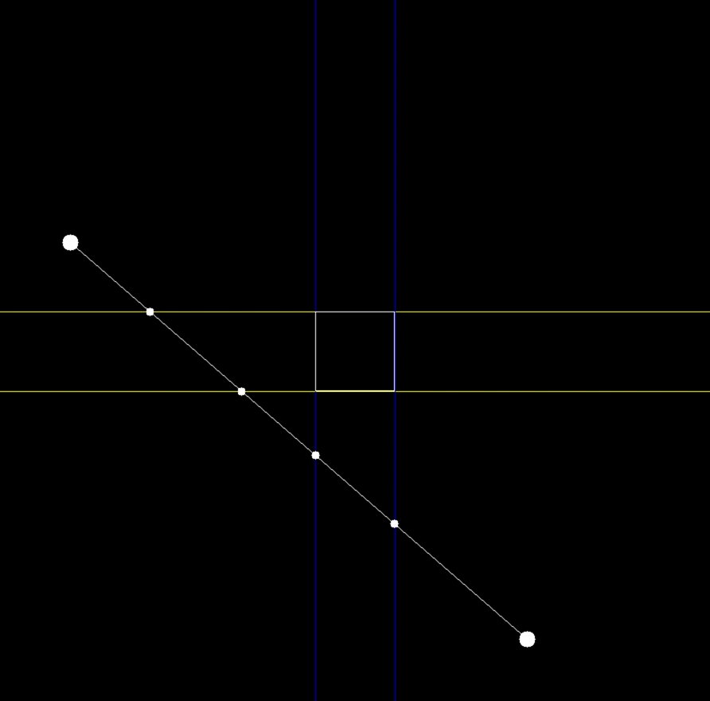
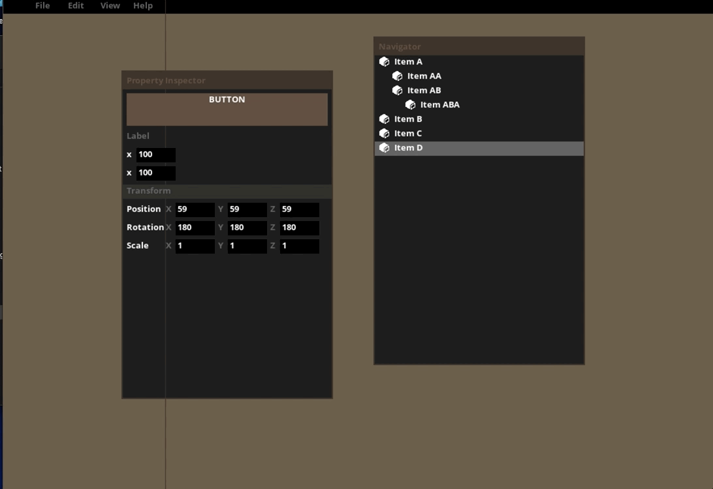
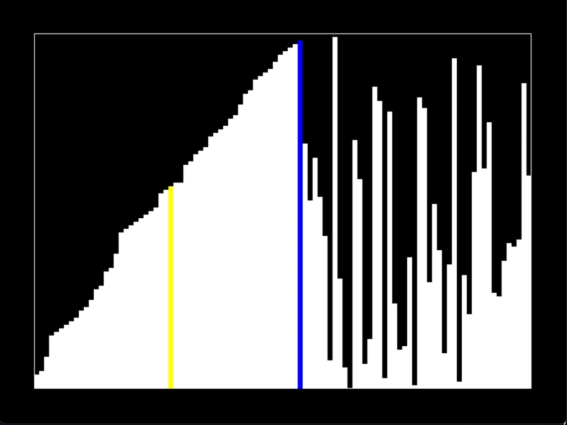

# SDL Mini Projects  

This repository is a collection of small **SDL2** projects I’ve built over time while experimenting with various **game development concepts** and **C++ techniques**. Each project serves as a learning experience, exploring different areas. 

## Projects Included  
- **2D Raycasting** – Basic implementation of raycasting for box2D 
- **Immediate Mode GUI** – A simple GUI system using SDL2 for rapid prototyping.  
- **Quadtree** – Spatial partitioning for optimizing collision detection.  

## Why This Repo Exists  
I created this repository as a **sandbox** to experiment with SDL2 and explore fundamental game development techniques. It’s an evolving collection where I refine my understanding of C++.  
